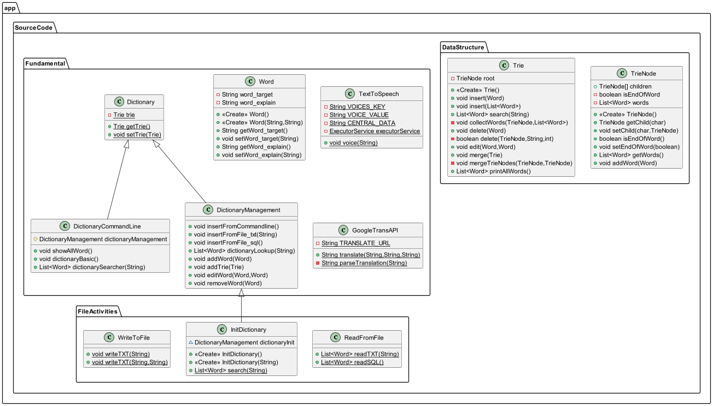
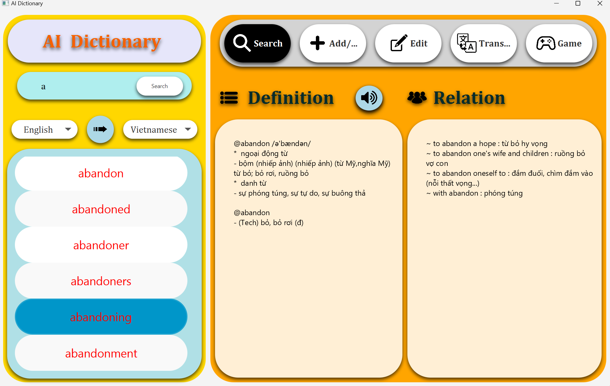
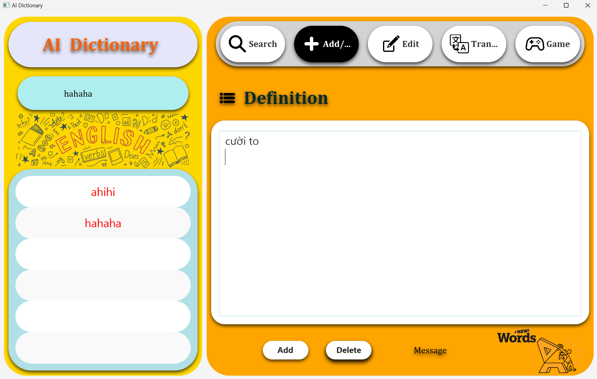
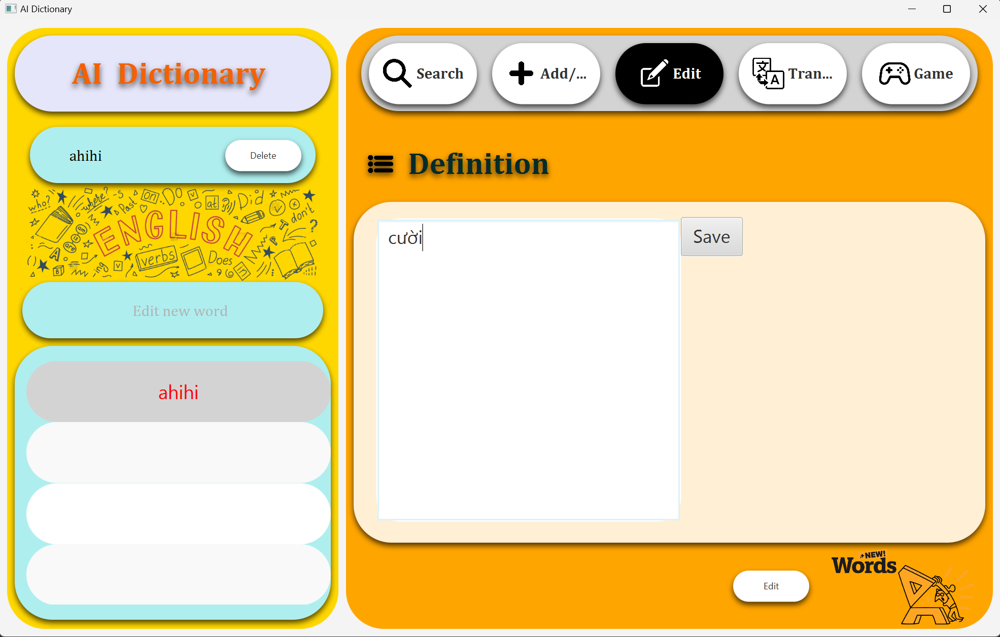
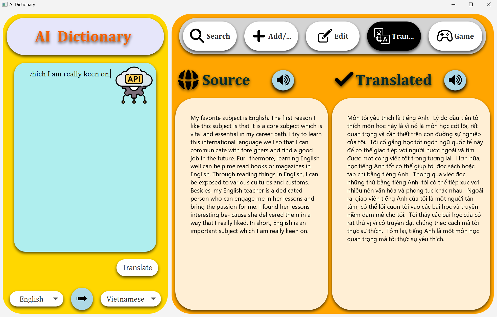

# **ARTIFICIAL INTELLIGENCE DICTIONARY 🧠**

## ***I. Introduction***

+ A graphical interface version of the English-Vietnamese dictionary application
+ Mainly written in Java code and JavaFX (GUI) framework
+ ***This project is a large assignment to get points for the Object - Oriented Programming (OOP) subject***

## ***II. Author***

+ **UNIVERSITY OF ENGINEERING AND TECHNOLOGY - VIETNAM NATIONAL UNIVERSITY**
+ ***Name:*** Mai Tien Dung
+ ***Student code:*** 23020025
+ ***Class:*** QH2023-I/CQ-C-B
+ ***Class code subject:*** H2324 INT2204 50

## ***III.Table of content***

- [Description](#description)
    * [App description and instruction](#app-description-and-instruction)
    * [Control](#control)
    * [Inheritance hierarchy](#inheritance-hierarchy)
- [Modes in app](#modes-in-app)
- [See also](#see-also)
  * [Used](#used)
  * [Reference](#Reference)

## **Description** 
### *App description and instruction* 

- Video demo :https://youtu.be/1ERVIwFQSKk
### *Control* 
- KeyBoard
- Cursor
### *Inheritance hierarchy*

## **Modes in app** 
#### *Search Mode*

#### *Add Mode*

#### *Edit Mode*

#### *Translate Mode*

#### *Game Mode*

## **Sea also** 
### *Used*
- Java (JDK 21) & IDEA Intelliji
- JavaFX (Maven)
- JavaFX scene builder 2.0
- CSS
- Trie data structure
- FreeTTS (Voice)
- Google Translate API
- MySQL
### *Reference*
- JavaFX tutorial
- Build: https://www.youtube.com/watch?v=YVXu7tmmQ0M&list=PLlGZc17KPrVAKj3Tl1im5HN8Lh5nYTXyB
- Read SQL JBDC 
- Picture: https://www.pinterest.com/
- Remove/Edit picture: Paint & https://www.remove.bg/
- ChatGPT

    

